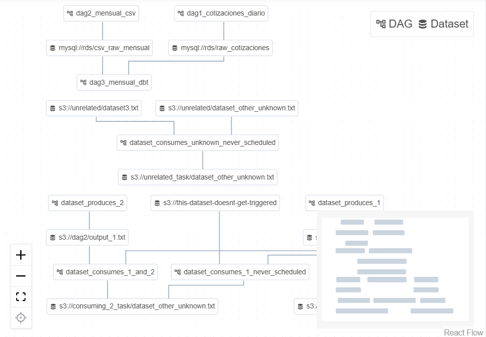
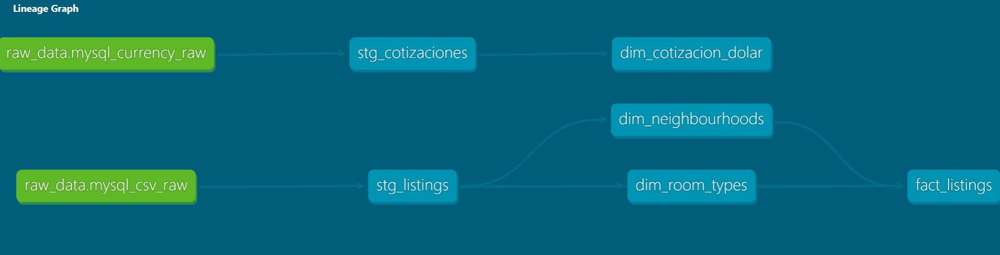

# Data Pipeline E2E: Real Estate & Currency Analytics 🚀

Este proyecto implementa una arquitectura de datos moderna (**Modern Data Stack**) para la ingesta, procesamiento y modelado de datos de mercado inmobiliario junto con la cotizacion de su divisa en pesos. La solución automatiza el flujo completo desde fuentes externas (APIs y archivos masivos) hasta un modelo de datos analítico en estrella (Kimball).

## 🏗️ Arquitectura del Sistema

El ecosistema está desplegado sobre infraestructura de **AWS**, orquestado mediante **Apache Airflow** corriendo en contenedores **Docker**.

1.  **Ingesta (Extract):**
    - **Pipeline Diario:** Consumo de API de cotización de dólar -> Almacenamiento en **AWS S3** (formato JSON).
    - **Pipeline Mensual:** Ingesta de datasets masivos de propiedades -> Almacenamiento en **AWS S3** (formato CSV).
2.  **Carga (Load):**
    - Scripts de Python (Boto3/Pandas/SQLAlchemy) extraen los archivos de S3 y los cargan en una base de datos **Amazon RDS (MySQL)** en la capa de datos crudos (`raw`).
3.  **Transformación (Transform - dbt):**
    - **Staging:** Limpieza, tipado y estandarización de datos mediante vistas.
    - **Core (Data Warehouse):** Creación de un **Modelo Estrella** (Fact & Dimension tables) para optimizar consultas analíticas y BI.

---

## 🛠️ Stack Tecnológico

- **Orquestación:** Apache Airflow 2.10.4 (Docker Compose).
- **Transformación:** dbt (Data Build Tool) Core 1.7.
- **Lenguajes:** Python (Pandas, SQLAlchemy, PyMySQL), SQL (Jinja2).
- **Infraestructura Cloud (AWS):**
  - **EC2:** Instancia Linux (8GB RAM) para el despliegue del orquestador.
  - **S3:** Data Lake para el almacenamiento de archivos crudos.
  - **RDS (MySQL):** Motor de base de datos relacional para el Data Warehouse.
  - **IAM & Security Groups:** Gestión estricta de permisos y conectividad entre servicios.

---

## 📂 Estructura del Repositorio

```text
├── airflow/
│   ├── dags/                # Definición de DAGs (Diarios/Mensuales)
│   ├── scripts/             # Lógica de ingesta (S3 to RDS)
│   ├── docker-compose.yaml  # Infraestructura de Airflow como Código
│   └── .env                 # Variables de entorno (Ignorado en Git)
├── dbt_project/             # Lógica de Transformación SQL
│   ├── models/
│   │   ├── staging/         # Modelos de limpieza inicial
│   │   └── core/            # Modelado Dimensional (Hechos y Dimensiones)
│   └── profiles.yml         # Configuración de conexión a RDS
└── README.md
```

## ⚙️ Configuración y Despliegue en AWS

### 1. Preparación de la Instancia EC2

- **Tipo de Instancia:** Recomendado `t3.medium` (8GB RAM) para evitar errores de memoria (OOM).
- **Almacenamiento:** Volumen EBS de **20GB** (mínimo recomendado para soportar las imágenes de Docker y los logs).
- **Security Groups:**
  - **Inbound:** Puerto `22` (SSH) y Puerto `8080` (Airflow UI) restringidos a tu IP.
  - **Conectividad RDS:** Asegurar que el Security Group de la base de datos RDS acepte tráfico en el puerto `3306` proveniente del Security Group de la EC2.

### 2. Configuración del Entorno Linux

Instalación de Docker y ajuste de permisos para el usuario `ubuntu`:

```bash
sudo apt-get update
sudo apt-get install -y docker.io docker-compose-v2
sudo usermod -aG docker $USER
# Es necesario cerrar la sesión SSH y volver a entrar para aplicar cambios
```

### 3. Expansión de Disco (Si el volumen es < 20GB)

En caso de requerir más espacio para las imágenes de Airflow y volúmenes de Docker:

```bash
# Expandir la partición (verificar nombre con lsblk)
sudo growpart /dev/nvme0n1 1

# Extender el sistema de archivos
sudo resize2fs /dev/nvme0n1p1
```

### 4. Variables de Entorno (`.env`)

Crear el archivo `.env` en la carpeta `airflow/` con las credenciales y configuraciones de las librerías necesarias:

```ini
AIRFLOW_IMAGE_NAME=apache/airflow:2.10.4
AIRFLOW_UID=1000
_PIP_ADDITIONAL_REQUIREMENTS=pandas requests boto3 sqlalchemy==1.4.54 pymysql dbt-core==1.7.19 dbt-mysql==1.7.0 apache-airflow-providers-amazon apache-airflow-providers-mysql
MYSQL_USER=tu_usuario
MYSQL_PASSWORD=tu_password
MYSQL_HOST=tu_rds_endpoint
MYSQL_NAME=tu_db_name
```

### 5. Despliegue del Pipeline

```bash
# Inicializar la base de datos interna de Airflow
sudo docker compose up airflow-init

# Levantar todos los servicios en segundo plano
sudo docker compose up -d

# Monitorear la instalación de librerías y el arranque
sudo docker compose logs -f airflow-webserver
```

## 📈 Modelado de Datos (Star Schema)

El diseño final implementa un modelo dimensional que permite cruzar la información de inmuebles con la fluctuación del dólar en tiempo real.

- **Fact Table:** `fact_listings` (Métricas de precios y disponibilidad).
- **Dimensions:** `dim_cotizacion_dolar`, `dim_neighbourhoods`, `dim_room_types`.

---

## 🔗 Flujo de Dependencias (Dataset Lineage)

Este gráfico muestra cómo el DAG de Transformación (dbt) se dispara automáticamente al completarse la ingesta de las fuentes diarias y mensuales.



---

## 🗄️ Linaje de Datos (dbt Models)

El siguiente gráfico detalla la transformación de los datos desde las tablas crudas (Raw), pasando por la limpieza (Staging), hasta el modelo final en estrella (Core).



---

## 👤 Autor

**Martin Daniel Tedesco** - _Data Engineer_
